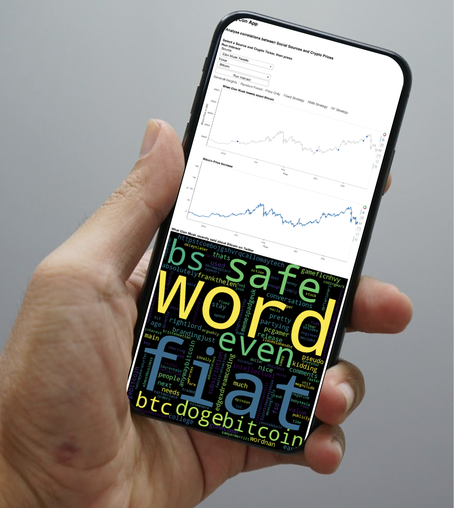

# SillyCon
### Algorithmic Trading Assistant

## Job description

- Shiva = General Insights (Historical), Word Cloud, README, Presentation

- Patricia = AWS Lex chatbot, Dashboard Concepts, Presentation

- Marianna = API Data Retrieval (Pickles), Data Processing, Google Trends, Presentation

- Fil = Main App, Data Processing (Random Forest price only), Dashboard, README, Presentation

- Mark = Main App, Data Processing (Fixed, RNN, RF), README, Presentation

## How to run the app

Option 1 - Type `python3 main.py` in Terminal to launch the dashboard

Option 2 - Copy `main.py` file into a Jupyter Lab notebook (ipynb) file and run to launch the dashboard

## Background
Near the inception of Fintech Project Two, Bitcoin and Dogecoin prices skyrocketed after Elon Musk's tweeted about each coin. Similarly, the price of Gamestop was causing trouble on Wallstreet after Reddit users "manipulated" the price of Gamestop (GME) shares. As such, the team theorised that there is a strong correlation between social media and the price movement of Bitcoin and Dogecoin.  The team decided to build an algorithmic trading assistant to analyse this in further detail for crypto traders.

## Hypothesis
Silicon Valley tech entrepreneurs tweets (e.g. from Elon Musk) have a high correlation to crypto price movements, and that this movement can be successfully predicted with machine learning models. 

## Goal
A web app (or Chatbot) where a user can choose to analyse the historical crypto price correlation to what a selected tech entrepreneur has said recently, and get an auto trading strategy based on it.

## User Input

- A drop-down list consisting two source selections:

     - Elon Musk Tweets

     - Google Trends Data
     

- A drop-down list for choosing the desired crypto coin:

     - Bitcoin

     - Dogecoin
     

## App Output

The app has an interface which provides the following output plots across multiple tabs:

- General insights plots
    - tweeting_price_curve_btc
    - tweeting_price_curve_doge
    - cumulative_return_curve_btc
    - cumulative_return_curve_doge
    - price_curve_btc
    - price_curve_doge

- Plots that show the results of a Random Forest model (Price only)
    - rf_ema_closing_prices_btc
    - rf_ema_daily_return_volatility_btc
    - rf_bollinger_closing_prices_btc
    - rf_predicted_vs_actual_btc
    - rf_predicted_vs_actual_last_ten_btc
    - rf_cumulative_return_btc
    - rf_ema_closing_prices_doge
    - rf_ema_daily_return_volatility_doge
    - rf_bollinger_closing_prices_doge
    - rf_predicted_vs_actual_doge
    - rf_predicted_vs_actual_last_ten_doge
    - rf_cumulative_return_doge

- Plots that show the results of a fixed trading strategy (Buy upon relevant Tweet, Sell 24hrs later)
    - entry_exit_price_plot_btc
    - entry_exit_portfolio_plot_btc
    - portfolio_evaluation_table_btc
    - entry_exit_price_plot_doge
    - entry_exit_portfolio_plot_doge
    - portfolio_evaluation_table_doge

- Plots that show the results of an algorithmic trading based on RNN LSTM (Price + Tweets)
    - rnn_predicted_positive_return_curve_btc
    - rnn_cumulative_return_plot_btc
    - rnn_predicted_positive_return_curve_doge
    - rnn_cumulative_return_plot_doge

- Plots that show the results of an algorithmic trading based on Random Forest (Price + Tweets)
    - rf_predicted_positive_return_curve_btc
    - rf_cumulative_return_plot_btc
    - rf_predicted_positive_return_curve_doge
    - rf_cumulative_return_plot_doge

- Plots that show the results of an algorithmic trading based on RNN LSTM (Price + Google Trends)
    - google_predicted_positive_return_curve_btc
    - google_cumulative_return_plot_btc

## Libraries Used

`pandas`, `pathlib`, `hvplot`, `tensorflow`, `sklearn`, `dotenv`, `numpy`, `random `, `os`, `json`, `pickle`, `re`, `time`, `bs4 `, `urllib`, `requests`, `datetime`, `sys`, `collections`

## APIs Used

`Twitter API `, `Cryptocompare API`

## Explanation of Each File and Folder 

- `main.py` = Main file which co-ordinates the entire app and calls functions in the other .py files (used for launching the app)

- `retrieve` folder (various files) = Fetches raw data from Twitter and Cryptocompare, and creates Pickle files for processing

- `clean_data.py` = Processes raw data (Pickle files) into suitable clean dataframes for consumption by machine learning models

- `algo_trading_rf.py` = Prepares data and trains model for Random Forest (Price + Tweets)

- `algo_trading_rnn.py` = Prepares data and trains model for Recurrent Neural Network (Price + Tweets)

- `algo_trading_rnn_google.py` = Prepares data and trains model for Recurrent Neural Network (Price + Google Trends)

- `model` folder (various files) = Stores Machine Learning models

- `data` folder (various files) = Stores ready-to-use datasets (e.g. clean DataFrames for analysis, algo trading results, etc.)

- `process_data.py` = Prepares data and trains model for Random Forest (Price only).  Runs all models and creates plots for Trading Strategies and General Insights

- `make_word_cloud.py` = Generates WordCloud images for plotting

- `build_dashboard.py` = Creates dashboard layout for Interact function outputs

- `chatbot` folder = Contains AWS Chatbot concept model (json)

- `image` folder (various files) = Contains WordCloud and ReadMe images

